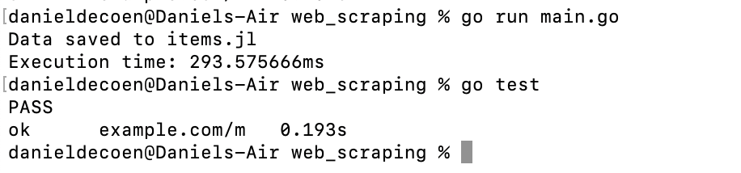

# web_scraping
Repo for WebScraping Assignment using Go

## Purpose - use Go to reproduce Web Scraping results similar to Python/Scrapy  

1. Leverage Go's standard library
2. Use Colly framework for webscraping https://github.com/gocolly/colly
3. Focus of the webscraping is *Wikipedia* for intelligent systems and robotics  

### Go and Colly  

After using the Colly framework and the Go Standard Libray, it seems like webscraping using Go is a very solid choice. It is possilbe to reproduce results that are generated from Python webscraping. There are some differences between Python and Go, with the main difference being the existence of packages in Python to take care of a lot of the scraping. For example, with Python, one can **nltk** for a listing of *stop words* in the English language. In Go, it was necessary to create a function to remove the *stop words*. Being able to change the list can be both a positive and a negative, depending on how much control one would like. **Go** definitely performs very quickly with the web crawl and sraping. See the results below:
  

